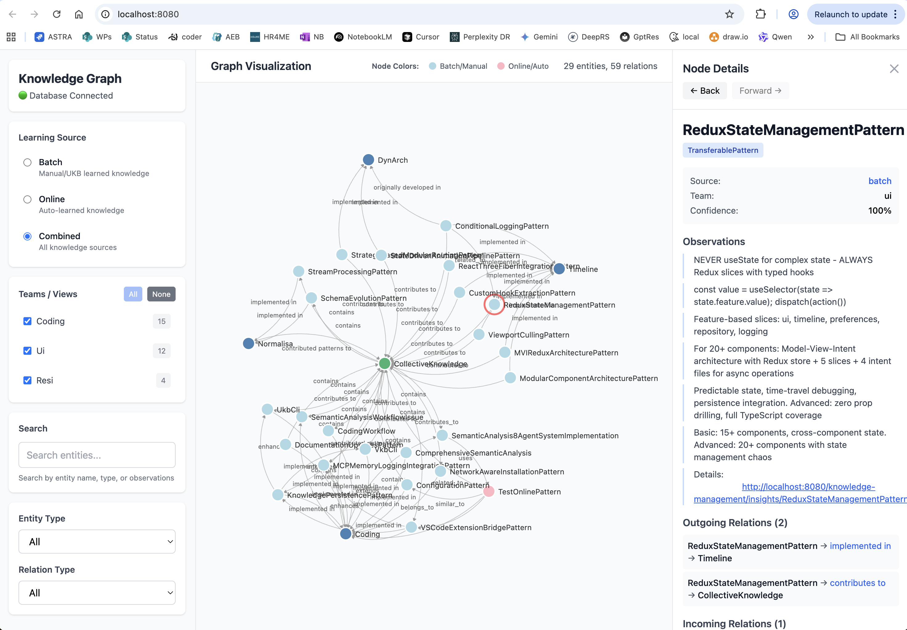
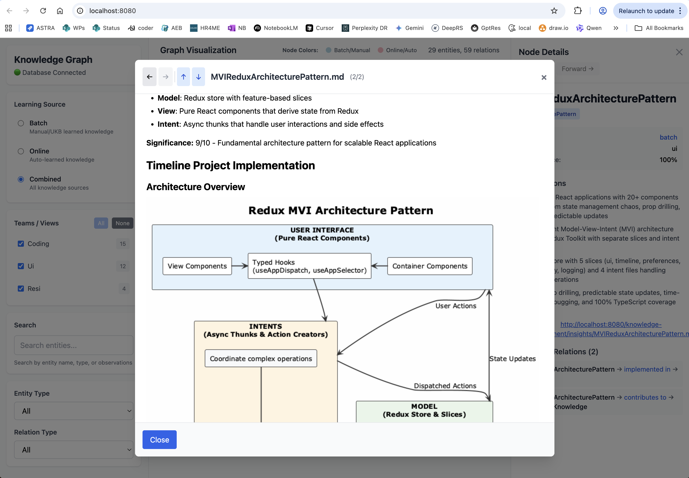

# Memory Visualizer

Web-based interactive knowledge graph viewer for exploring entities, relations, and observations stored in the coding project's GraphDB (LevelDB). Features real-time filtering, multi-team support, and rich markdown rendering with embedded diagrams.



*Interactive graph visualization with team filtering, search, and detailed entity information panels*

---

## ✨ Features

### Core Visualization

- **🌐 Interactive Graph Layout** - D3.js force-directed visualization with drag, zoom, and pan
- **👥 Multi-Team Support** - Switch between team-specific knowledge bases (coding, ui, rest)
- **🔍 Advanced Filtering** - Filter by entity type, relation type, learning source, and text search
- **📊 Real-Time Statistics** - Live counts of entities and relations displayed
- **🎯 Node Selection** - Click any entity to view detailed information and relationships

### Knowledge Display

- **📝 Rich Markdown Rendering** - Full support for markdown in observations with syntax highlighting
- **📐 Embedded Diagrams** - Automatic rendering of PlantUML and Mermaid diagrams in observations
- **🔗 Relationship Tracking** - View incoming and outgoing relations with confidence scores
- **🏷️ Source Attribution** - See which learning source created each entity (batch, auto, manual)
- **💯 Confidence Scoring** - Visual indicators of knowledge confidence levels

### Data Integration

- **💾 GraphDB (LevelDB) Connection** - Real-time queries to `.data/knowledge-graph/`
- **🔄 Live Updates** - Reflects current state of knowledge base
- **🏢 Team Isolation** - Separate knowledge graphs per team/project
- **📂 Multiple Sources** - Combines knowledge from UKB, VKB, and Continuous Learning

---

## 🚀 Quick Start

### Prerequisites

The Memory Visualizer is part of the coding project and requires:

- **GraphDB running** - Knowledge base at `.data/knowledge-graph/`
- **Node.js 18+** - For running the development server
- **Port 8080** - Default port for the visualizer

### Starting the Visualizer

```bash
# Navigate to memory-visualizer directory
cd integrations/memory-visualizer

# Install dependencies (first time only)
npm install

# Start the development server
npm run dev

# Open browser to http://localhost:8080
```

The visualizer will automatically connect to your local GraphDB and load available knowledge graphs.

---

## 📸 Interface Overview

### Main Interface


**Left Sidebar - Filters & Controls:**
- **Database Connection** - Connection status indicator
- **Learning Source** - Filter by batch/auto/manual knowledge
- **Teams/Views** - Switch between team knowledge bases
- **Search** - Real-time text search across entities
- **Entity Type** - Filter by entity type
- **Relation Type** - Filter by relationship type

**Center Panel - Graph Visualization:**
- Interactive force-directed graph
- Color-coded nodes by entity type
- Labeled edges showing relationships
- Drag nodes to reposition
- Zoom and pan for navigation

**Right Sidebar - Node Details:**
- Entity name and type
- Source and team attribution
- Confidence score
- Full observations with markdown
- Incoming and outgoing relations

### Entity Details View



**Rich Content Display:**
- Markdown formatted observations
- Embedded architecture diagrams (PlantUML/Mermaid)
- Syntax-highlighted code blocks
- Hyperlinked references
- Relationship visualizations

---

## 🎯 Use Cases

### For Development Teams

**Explore Project Knowledge:**
- View all captured patterns, solutions, and architectural decisions
- Understand relationships between concepts
- Find relevant past solutions to current problems
- Verify knowledge consistency across team

**Knowledge Quality Assurance:**
- Review confidence scores of entities
- Identify gaps in knowledge coverage
- Verify proper entity type classification
- Check relationship completeness

### For Individual Developers

**Knowledge Discovery:**
- Search for specific patterns or solutions
- Navigate related concepts through graph
- Review detailed observations and examples
- Access embedded documentation and diagrams

**Learning and Reference:**
- Understand system architecture visually
- See how components relate to each other
- Access code examples and best practices
- Review lessons learned from past work

### For Knowledge Management

**Analysis and Curation:**
- Identify entity clusters and communities
- Find orphaned or disconnected knowledge
- Review knowledge sources (batch vs auto vs manual)
- Monitor team-specific knowledge growth

**Multi-Team Coordination:**
- Switch between team knowledge bases
- Identify cross-team patterns
- Ensure knowledge sharing
- Maintain team isolation where needed

---

## 📖 Documentation

### User Documentation

- **[User Guide](docs/user-guide.md)** - Complete usage instructions
  - Interface overview and navigation
  - Filtering and search capabilities
  - Understanding the graph visualization
  - Working with entity details
  - Team and source filtering
  - Keyboard shortcuts and tips

### Technical Documentation

- **[Architecture](docs/architecture.md)** - System design and implementation
  - Component architecture and data flow
  - React + Redux state management
  - D3.js visualization layer
  - GraphDB integration details
  - Performance characteristics
  - Technology stack

- **[Development Guide](docs/development.md)** - For contributors
  - Development environment setup
  - Project structure and organization
  - Adding new features and components
  - Testing and debugging
  - Build and deployment processes

### Architecture Diagrams


*Complete system architecture showing frontend components, state management, and data sources*


*End-to-end data flow from GraphDB query through visualization rendering*


*Detailed component hierarchy and module relationships*

---

## 🛠️ Technology Stack

### Frontend Framework

- **React 18.2** - UI components and state management
- **TypeScript 5.3** - Type-safe development
- **Redux Toolkit 2.9** - Centralized state management
- **Vite 6.0** - Build tool with fast HMR

### Visualization

- **D3.js 7.8** - Force-directed graph layout and rendering
- **SVG Rendering** - Scalable interactive graphics
- **Custom Force Simulation** - Optimized node positioning

### Content Rendering

- **react-markdown 10.1** - GitHub-flavored markdown support
- **remark-gfm 4.0** - Extended markdown features
- **rehype-highlight 7.0** - Syntax highlighting for code blocks
- **highlight.js 11.11** - 180+ language support
- **Mermaid 11.6** - Diagram rendering in markdown

### Styling

- **TailwindCSS 3.4** - Utility-first CSS framework
- **Custom Component Styles** - Tailored UI components
- **Responsive Design** - Adapts to different screen sizes

### Data Integration

- **GraphDB (LevelDB)** - Persistent knowledge graph storage at `.data/knowledge-graph/`
- **Database Client API** - TypeScript interface to GraphDB
- **Real-Time Queries** - Live data fetching with team isolation
- **Multi-Team Support** - Separate knowledge bases per team

---

## 🔌 Integration with Coding Project

The Memory Visualizer is tightly integrated with the coding project's knowledge management ecosystem:

### Knowledge Sources

**1. UKB (Update Knowledge Base)**
- Manual knowledge capture via command line
- Creates entities with high confidence scores
- Source: `manual`

**2. VKB (Visualize Knowledge Base)**
- Alternative web-based viewer (port 8080)
- Uses same GraphDB backend
- Source: `manual` or `batch`

**3. Continuous Learning System**
- Automatic knowledge extraction during coding sessions
- Real-time entity and relation creation
- Source: `auto`

**4. Semantic Analysis (10-Agent System)**
- Deep repository analysis workflows
- Pattern extraction and insight generation
- Source: `batch`

### Data Flow

```
UKB/VKB/Continuous Learning → GraphDB (LevelDB) → Memory Visualizer
                                   ↓
                        .data/knowledge-graph/
                                   ↓
                        shared-memory-*.json (export)
```

### Team Isolation

Each team has its own isolated knowledge base:

- **coding** - Infrastructure and tooling knowledge
- **project-specific** - Domain knowledge per project
- **ui** - UI/UX patterns and components
- **rest** - API and backend patterns

Switch between teams seamlessly in the visualizer.

---

## 🎨 Interface Features

### Graph Visualization Controls

**Navigation:**
- **Click and drag** - Pan the graph
- **Mouse wheel** - Zoom in/out
- **Click node** - Select entity and view details
- **Drag node** - Reposition individual nodes
- **Double-click** - Reset view/deselect

**Visual Encoding:**
- **Node color** - Entity type (pattern, solution, tool, etc.)
- **Node size** - Number of observations (larger = more content)
- **Edge thickness** - Relationship strength/confidence
- **Edge labels** - Relationship type names

### Filtering System

**Learning Source Filter:**
- **Batch** - Knowledge from automated analysis
- **Auto** - Continuous learning during sessions
- **Manual** - User-created knowledge via UKB
- **All** - Show all sources

**Team/View Filter:**
- Select from available teams
- View team-specific knowledge graphs
- Isolates team data completely

**Entity Type Filter:**
- Pattern, Solution, Architecture, Tool, Workflow, Problem
- Custom types from your knowledge base
- Multi-select support

**Relation Type Filter:**
- implements, solves, uses, depends_on, related_to
- Custom relationship types
- Show/hide specific connection types

**Text Search:**
- Search entity names and content
- Real-time filtering as you type
- Highlights matching nodes

### Node Details Panel

**Entity Information:**
- **Name** - Entity identifier
- **Type** - Classification (Pattern, Solution, etc.)
- **Source** - Learning source (batch/auto/manual)
- **Team** - Owning team
- **Confidence** - Quality score (0-100%)

**Observations:**
- Markdown-formatted content
- Syntax-highlighted code blocks
- Embedded diagrams (PlantUML, Mermaid)
- Bulleted facts and notes
- Hyperlinked references

**Relations:**
- **Outgoing** - Entities this one relates to
- **Incoming** - Entities that reference this one
- Confidence scores for each relation
- Click to navigate to related entities

---

## 🚀 Performance

### Optimization Strategies

**Graph Rendering:**
- Efficient D3 force simulation
- Optimized for graphs up to 1000+ nodes
- Canvas fallback for very large graphs
- Viewport culling for off-screen nodes

**State Management:**
- Memoized Redux selectors
- Normalized state for O(1) lookups
- Efficient re-render prevention

**Data Loading:**
- Lazy loading of node details
- Incremental graph updates
- Throttled filter application

### Scalability

**Small Graphs** (<100 nodes):
- Instant rendering and smooth interactions
- All features fully responsive

**Medium Graphs** (100-500 nodes):
- Fast rendering (<500ms)
- Optimized force simulation
- Selective label rendering

**Large Graphs** (500-1000+ nodes):
- Efficient layout algorithms
- Strategic filtering recommended
- Team isolation helps manage complexity

---

## 🔧 Configuration

### Development Server

Default configuration in `package.json`:

```json
{
  "scripts": {
    "dev": "vite",
    "build": "vite build",
    "preview": "vite preview"
  }
}
```

### GraphDB Connection

The visualizer automatically connects to:

```
.data/knowledge-graph/
├── entities/
├── relations/
└── metadata/
```

Ensure this directory exists and contains valid GraphDB data.

### Port Configuration

Default port is 8080. To change, edit `vite.config.ts`:

```typescript
export default defineConfig({
  server: {
    port: 8080, // Change to desired port
  },
});
```

---

## 🐛 Troubleshooting

### No Data Displayed

**Issue:** Graph shows "Database Connected" but no entities

**Solutions:**
- Verify `.data/knowledge-graph/` exists
- Check that GraphDB contains data for selected team
- Try selecting different team from dropdown
- Run `ukb` to create some knowledge first

### Performance Issues

**Issue:** Slow rendering with large graphs

**Solutions:**
- Use team filter to reduce visible nodes
- Apply entity type filters
- Use search to focus on specific entities
- Consider splitting knowledge into more teams

### Connection Failed

**Issue:** "Database Disconnected" status

**Solutions:**
- Verify visualizer is running from correct directory
- Check `.data/knowledge-graph/` path is correct
- Ensure proper file permissions
- Restart development server

### Markdown/Diagrams Not Rendering

**Issue:** Observations show raw markdown or diagram code

**Solutions:**
- Check markdown syntax is valid
- Verify PlantUML/Mermaid syntax
- Check browser console for errors
- Ensure dependencies are installed

---

## 📦 Deployment

### Development

```bash
npm run dev
```

Runs on `http://localhost:8080` with hot module replacement.

### Production Build

```bash
npm run build
```

Generates optimized static files in `dist/` directory.

**Note:** Production builds require proper GraphDB connection configuration for your deployment environment.

### Integration with Coding Project

The visualizer is designed to run as part of the coding project ecosystem:

1. Start coding services: `coding` or `coding --claude`
2. Access Memory Visualizer at `http://localhost:8080`
3. Automatically connects to local GraphDB
4. No additional configuration needed

---

## 🤝 Contributing

Contributions welcome! See [Development Guide](docs/development.md) for details.

### Development Workflow

1. Fork the repository
2. Create feature branch: `git checkout -b feature/my-feature`
3. Make changes with proper TypeScript types
4. Test thoroughly with real GraphDB data
5. Update documentation as needed
6. Submit pull request with clear description

### Code Standards

- TypeScript strict mode enabled
- Functional React components with hooks
- Redux Toolkit for all state management
- TailwindCSS for styling (no inline styles)
- Conventional commit messages
- Comprehensive JSDoc comments

---

## 🔗 Related Documentation

- **[User Guide](docs/user-guide.md)** - Complete usage instructions and tips
- **[Architecture](docs/architecture.md)** - Technical architecture and design decisions
- **[Development Guide](docs/development.md)** - Setup, contributing, and deployment
- **[GraphDB Documentation](../../docs/knowledge-management/)** - Knowledge base system docs
- **[UKB/VKB Documentation](../../docs/knowledge-management/README.md)** - Knowledge management tools

---

## 📊 Project Status

**Version:** 1.0.0
**Status:** Production Ready ✅
**Last Updated:** 2025-10-26

### Current Features

- ✅ Interactive D3.js force-directed graph
- ✅ Multi-team knowledge base support
- ✅ Advanced filtering (type, source, team, search)
- ✅ Rich markdown rendering with syntax highlighting
- ✅ Embedded diagram support (PlantUML, Mermaid)
- ✅ Real-time GraphDB (LevelDB) integration
- ✅ Confidence scoring and source attribution
- ✅ Relationship visualization and navigation
- ✅ Responsive design and optimized performance

### Roadmap

- ⏳ Graph export (PNG, SVG, filtered subgraphs)
- ⏳ Advanced analytics and metrics dashboard
- ⏳ Custom visualization layouts (hierarchical, circular)
- ⏳ Collaborative annotations and comments
- ⏳ Version history and diff visualization
- ⏳ Knowledge quality scoring and recommendations

---

## 📝 License

Part of the Coding project. Copyright © 2024. All rights reserved.

---

*Built for exploring and understanding the knowledge accumulated across your development journey*
