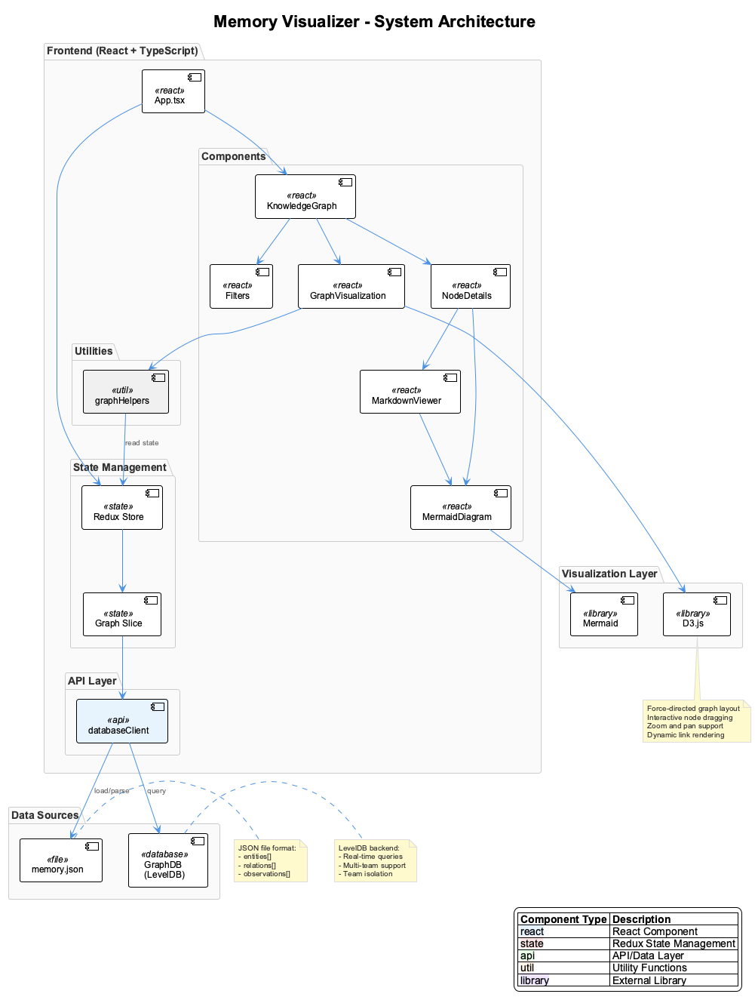
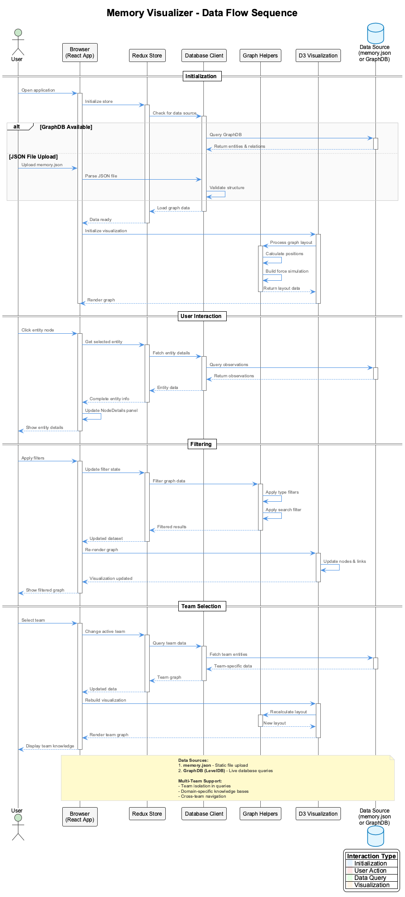
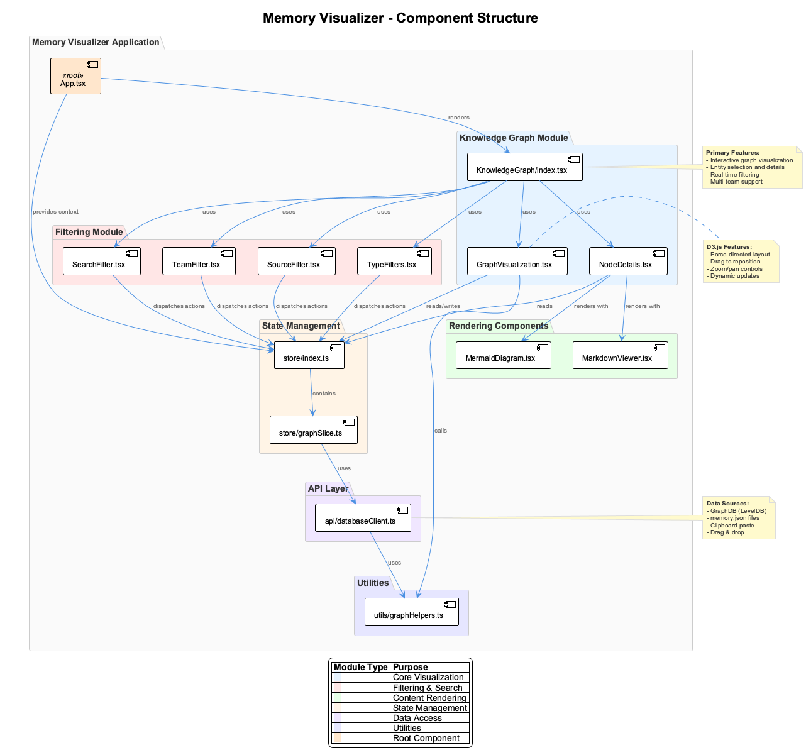

# Memory Visualizer - Architecture Documentation

## Overview

The Memory Visualizer is a React-based web application that provides interactive visualization and exploration of knowledge graphs stored in Anthropic's Memory MCP format. It supports both static JSON file uploads and real-time GraphDB (LevelDB) queries with multi-team isolation.



*High-level system architecture showing the Frontend, Visualization Layer, and Data Sources*

---

## System Components

### Frontend Layer (React + TypeScript)

The frontend is built with modern React using TypeScript for type safety and maintainability.

#### Core Application

- **App.tsx**: Root component that provides Redux context and application layout
- **React 18**: Latest React features including concurrent rendering
- **TypeScript 5.3+**: Strong typing for better developer experience

#### Component Modules

**Knowledge Graph Module**:
- `KnowledgeGraph/index.tsx` - Main container orchestrating visualization
- `GraphVisualization.tsx` - D3.js-powered force-directed graph
- `NodeDetails.tsx` - Entity information sidebar with observations

**Filtering Module**:
- `TypeFilters.tsx` - Entity and relation type dropdowns
- `SearchFilter.tsx` - Real-time text search across entities/relations
- `TeamFilter.tsx` - Multi-team selection and domain isolation
- `SourceFilter.tsx` - Data source selection (JSON upload vs GraphDB)

**Rendering Components**:
- `MarkdownViewer.tsx` - GitHub-flavored markdown with syntax highlighting
- `MermaidDiagram.tsx` - Automatic Mermaid diagram rendering

### State Management (Redux Toolkit)

Centralized state management using Redux Toolkit for predictable state updates:

- **Redux Store**: Global application state container
- **Graph Slice**: Manages graph data, filters, and selection state
- **Actions & Reducers**: Type-safe state mutations
- **Middleware**: Async data loading and side effects

### API Layer

**Database Client** (`api/databaseClient.ts`):
- GraphDB (LevelDB) query interface
- JSON file parsing and validation
- Team-based data filtering
- Memory.json format support

### Utilities

**Graph Helpers** (`utils/graphHelpers.ts`):
- Force-directed layout algorithms
- Graph traversal and filtering
- Data transformation utilities
- Type-safe graph operations

---

## Visualization Layer

### D3.js Integration

The graph visualization uses D3.js for interactive force-directed layouts:

**Features**:
- **Force Simulation**: Physics-based node positioning
- **Interactive Dragging**: Reposition nodes with mouse/touch
- **Zoom & Pan**: Navigate large graphs smoothly
- **Dynamic Updates**: Real-time graph modifications
- **Link Rendering**: Curved links with directional arrows

**Layout Algorithm**:
- Force-directed graph with customizable forces
- Link distance based on relationship type
- Collision detection for node spacing
- Center gravity to prevent drift

### Mermaid Support

Automatic detection and rendering of Mermaid diagrams in markdown content:
- Class diagrams
- Sequence diagrams
- Flowcharts
- Entity-relationship diagrams

---

## Data Sources

### 1. Memory.json Files (Static)

Anthropic's Memory MCP format containing:

```json
{
  "entities": [
    {
      "name": "Entity Name",
      "entityType": "Type",
      "observations": ["Fact 1", "Fact 2"]
    }
  ],
  "relations": [
    {
      "from": "Entity A",
      "to": "Entity B",
      "relationType": "relationship_type"
    }
  ]
}
```

**Loading Methods**:
- File upload via drag & drop
- Browse and select file
- Paste JSON from clipboard

### 2. GraphDB (LevelDB) - Live Queries

Real-time database queries for dynamic knowledge graphs:

**Storage Location**: `.data/knowledge-graph/`

**Features**:
- Multi-team support with isolation
- Domain-specific knowledge bases
- Persistent storage across sessions
- Bidirectional sync with JSON exports

**Team Structure**:
```
GraphDB
├── Team: coding
│   ├── Entities
│   ├── Relations
│   └── Observations
├── Team: project-a
│   └── ...
└── Team: project-b
    └── ...
```

---

## Data Flow



*Complete data flow from initialization through user interactions*

### Initialization Flow

1. **Application Start**: User opens visualizer
2. **Store Initialization**: Redux store created
3. **Data Source Check**: Query GraphDB or await file upload
4. **Data Loading**: Parse and validate graph structure
5. **Visualization Setup**: D3 force simulation initialization
6. **Initial Render**: Display interactive graph

### User Interaction Flow

**Entity Selection**:
1. User clicks entity node
2. Store retrieves entity details
3. Database client fetches observations
4. NodeDetails panel updates
5. Related entities highlighted

**Filtering**:
1. User applies filter (type, search, team)
2. Redux action dispatched
3. Graph helpers filter data
4. D3 visualization updates
5. Filtered graph rendered

**Team Navigation**:
1. User selects team from dropdown
2. Store updates active team
3. Client queries team-specific data
4. Graph recalculated and re-rendered
5. Team knowledge displayed

---

## Component Structure



*Detailed component hierarchy and module relationships*

### Module Organization

**Knowledge Graph Module** (Blue):
- Core visualization components
- Primary user interaction layer
- Graph rendering and node details

**Filtering Module** (Pink):
- Search and filter components
- Data source selection
- Team navigation

**Rendering Components** (Green):
- Content display utilities
- Markdown and diagram support
- Syntax highlighting

**State Management** (Beige):
- Redux store and slices
- Centralized state
- Action dispatchers

**API Layer** (Purple):
- Database client
- Data validation
- Query interface

**Utilities** (Light Blue):
- Helper functions
- Graph algorithms
- Data transformations

---

## Technology Stack

### Core Technologies

- **React 18.2**: UI framework with concurrent features
- **TypeScript 5.3**: Type-safe development
- **Redux Toolkit 2.9**: State management
- **D3.js 7.8**: Data visualization
- **Vite 6.0**: Build tool and dev server
- **TailwindCSS 3.4**: Utility-first styling

### Rendering & Display

- **react-markdown**: Markdown rendering with GFM support
- **rehype-highlight**: Syntax highlighting via highlight.js
- **Mermaid 11.6**: Diagram rendering
- **highlight.js 11.11**: Code syntax highlighting

### Development Tools

- **Vite**: Lightning-fast HMR and builds
- **PostCSS**: CSS processing
- **Autoprefixer**: Browser compatibility
- **ESLint & Prettier**: Code quality and formatting

---

## Performance Characteristics

### Optimization Strategies

**Graph Rendering**:
- Throttled force simulation updates
- Canvas-based rendering for large graphs (>1000 nodes)
- SVG for smaller graphs (<1000 nodes)
- Viewport culling for off-screen nodes

**State Management**:
- Memoized selectors to prevent re-renders
- Normalized state shape for O(1) lookups
- Shallow equality checks in Redux

**Data Loading**:
- Lazy loading for large JSON files
- Incremental parsing for streaming
- Worker threads for heavy computations

### Scalability

**Small Graphs** (<100 nodes):
- Instant rendering (<100ms)
- Smooth animations
- All features enabled

**Medium Graphs** (100-1000 nodes):
- Fast rendering (<500ms)
- Optimized force simulation
- Selective label rendering

**Large Graphs** (1000+ nodes):
- Canvas fallback rendering
- Clustering for overview
- On-demand detail loading

---

## Security Considerations

### Data Privacy

- **Local-First**: All processing happens in browser
- **No Server Upload**: JSON files never leave client
- **Memory Isolation**: Team data segregated in GraphDB

### Input Validation

- **JSON Schema Validation**: Strict format checking
- **XSS Protection**: Sanitized markdown rendering
- **Type Safety**: TypeScript guards against invalid data

---

## Deployment Architecture

### Production Build

```bash
npm run build
```

**Output**:
- Optimized bundle with tree-shaking
- Code splitting for lazy loading
- Minified CSS and JS
- Source maps for debugging

### Hosting Options

**Static Hosting**:
- Vercel, Netlify, GitHub Pages
- CDN for global distribution
- HTTPS required for clipboard API

**Self-Hosted**:
- Nginx or Apache static server
- Docker container deployment
- Kubernetes for scaling

---

## Extension Points

### Adding New Visualizations

1. Create new component in `components/`
2. Connect to Redux store via `useSelector`
3. Subscribe to graph data changes
4. Implement custom rendering logic

### Custom Data Sources

1. Implement `DataSource` interface in `api/`
2. Add source selection in `SourceFilter.tsx`
3. Register source in `databaseClient.ts`
4. Handle data format transformations

### New Filter Types

1. Create filter component in `components/Filters/`
2. Add filter state to `graphSlice.ts`
3. Implement filter logic in `graphHelpers.ts`
4. Connect via Redux actions

---

## Related Documentation

- **[User Guide](user-guide.md)** - End-user documentation
- **[API Reference](api-reference.md)** - Component and function APIs
- **[Development Guide](development.md)** - Setup and contribution guide

---

*Architecture documentation for Memory Visualizer v1.0.0*
