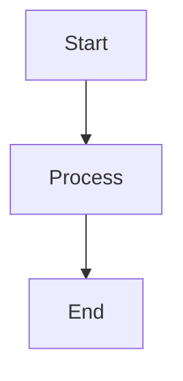

# Memory Visualizer - User Guide

## Quick Start

The Memory Visualizer helps you explore and debug knowledge graphs created by Claude Desktop's Memory MCP server or the coding project's GraphDB system.

### Access

**Online Version**: [https://memviz.herich.tech](https://memviz.herich.tech)

**Local Installation**:
```bash
cd integrations/memory-visualizer
npm install
npm run dev
```

---

## Main Interface


*Main visualization interface showing the interactive knowledge graph*

### Interface Components

1. **Graph Canvas** (Center): Interactive force-directed graph visualization
2. **Control Panel** (Top): Filters, search, and data source selection
3. **Details Panel** (Right): Entity information and observations
4. **Statistics** (Top Left): Entity count, relation count, type counts

---

## Loading Data

### Method 1: Upload JSON File

1. Click **"Upload New File"** button (top right)
2. Select `memory.json` file from your system
3. **Alternative**: Drag and drop file onto the canvas
4. **Alternative**: Copy JSON to clipboard and paste (Ctrl/Cmd+V)

**Supported Format**:
```json
{
  "entities": [...],
  "relations": [...]
}
```

### Method 2: GraphDB Connection (Local Development)

For real-time data from the coding project's GraphDB:

1. Start the visualizer locally: `npm run dev`
2. GraphDB automatically connects to `.data/knowledge-graph/`
3. Select team from **Team Filter** dropdown
4. Graph loads automatically

---

## Navigating the Graph


*Detailed entity information panel showing observations and relationships*

### Basic Navigation

**Zoom**:
- Mouse wheel: Zoom in/out
- Trackpad: Pinch to zoom
- Touch: Pinch gesture

**Pan**:
- Click and drag empty space
- Touch: Drag with one finger

**Select Entity**:
- Click any node to view details
- Right panel shows observations and relations
- Connected nodes highlight

**Reposition Nodes**:
- Click and drag nodes to new positions
- Force simulation adjusts layout dynamically
- Positions reset on data reload

### Graph Controls

**Fit to View**: Double-click empty space to center graph

**Reset Layout**: Refresh page to recalculate positions

---

## Filtering and Search

### Entity Type Filter

Filter nodes by entity type:

1. Click **"Filter by Entity Type"** dropdown
2. Select one or more types
3. Graph shows only matching entities
4. Related relations also filtered

**Common Types**:
- Pattern, Solution, Architecture
- Tool, Workflow, Problem
- Custom types from your knowledge base

### Relation Type Filter

Filter edges by relationship type:

1. Click **"Filter by Relation Type"** dropdown
2. Select relationship types
3. Graph shows only selected relationships

**Common Relations**:
- implements, solves, uses
- depends_on, related_to, improves

### Search

Real-time text search across entities:

1. Type in **Search** box (top left)
2. Searches entity names and content
3. Matching entities highlighted
4. Non-matching nodes dimmed

**Search Tips**:
- Case-insensitive
- Partial matches supported
- Use quotes for exact phrases

### Team Filter (GraphDB Only)

When connected to GraphDB:

1. Select team from **Team Filter** dropdown
2. View team-specific knowledge base
3. Each team's data isolated
4. Switch teams instantly

---

## Understanding the Visualization

### Node Colors

Nodes are color-coded by entity type:

- **Purple**: Memory/Core entities
- **Orange**: Important/Featured entities
- **Blue**: Standard entities
- **Green**: Tools/Technologies
- **Teal**: Workflows/Processes
- **Gray**: Generic/Untyped entities

### Node Sizes

- Larger nodes: More observations attached
- Smaller nodes: Fewer observations
- Size indicates information richness

### Link Styles

- **Solid arrows**: Direct relationships
- **Arrow direction**: Relationship direction (A → B)
- **Curved lines**: Multiple relations between nodes
- **Link labels**: Relationship type names

---

## Entity Details Panel

### Viewing Details

Click any node to view:

1. **Entity Name**: Displayed at top
2. **Entity Type**: Category classification
3. **Observations**: List of facts/notes
4. **Relations**: Connected entities

### Observations

Each observation represents an atomic fact:

- Displayed as bullet points
- Can contain markdown formatting
- May include code blocks
- Automatically detects Mermaid diagrams

### Relations

Shows all connections:

**Outbound** (this entity → other):
- Listed with arrow →
- Shows relationship type
- Click to navigate

**Inbound** (other → this entity):
- Listed with arrow ←
- Shows source entity
- Click to view source

---

## Advanced Features

### Markdown Support

Observations support GitHub-Flavored Markdown:

- **Headings**: `# H1`, `## H2`, etc.
- **Bold**: `**text**` or `__text__`
- **Italic**: `*text*` or `_text_`
- **Code**: `` `inline` `` or ` ```block``` `
- **Lists**: `-` or `*` for bullets, `1.` for numbered
- **Links**: `[text](url)`
- **Tables**: Pipe-separated with headers

### Syntax Highlighting

Code blocks automatically highlighted:

````markdown
```typescript
interface Entity {
  name: string;
  entityType: string;
  observations: string[];
}
```
````

Supports 180+ languages via highlight.js.

### Mermaid Diagrams

Mermaid diagrams render automatically:

````markdown

````

**Supported Diagram Types**:
- Flowcharts
- Sequence diagrams
- Class diagrams
- ER diagrams
- Gantt charts

---

## Data Sources

### Memory.json Format

Standard Anthropic Memory MCP format:

```json
{
  "entities": [
    {
      "name": "React Hooks",
      "entityType": "Pattern",
      "observations": [
        "useState for local state",
        "useEffect for side effects",
        "Custom hooks for reusable logic"
      ]
    }
  ],
  "relations": [
    {
      "from": "React Hooks",
      "to": "React",
      "relationType": "part_of"
    }
  ]
}
```

### GraphDB (LevelDB)

Live database at `.data/knowledge-graph/`:

**Features**:
- Real-time updates
- Multi-team isolation
- Persistent storage
- Automatic sync

**Team Structure**:
- Each team has isolated graph
- Cross-team references supported
- Domain-specific knowledge bases

---

## Keyboard Shortcuts

| Shortcut | Action |
|----------|--------|
| `Ctrl/Cmd + V` | Paste JSON from clipboard |
| `Escape` | Clear selection |
| `F` | Fit graph to view |
| `R` | Reset zoom |
| `/` | Focus search box |

---

## Tips & Best Practices

### For Better Visualization

1. **Use Descriptive Names**: Clear entity names improve readability
2. **Limit Observations**: Keep facts atomic and focused
3. **Type Consistency**: Use consistent entity/relation types
4. **Directed Relations**: Use active voice (e.g., "implements" not "implemented_by")

### For Large Graphs

1. **Use Filters**: Focus on specific entity types
2. **Team Isolation**: Split large graphs into team domains
3. **Search First**: Find entities before exploring visually
4. **Export Subgraphs**: Save filtered views for later

### For Analysis

1. **Follow Relations**: Click through connected entities
2. **Check Observations**: Read facts in detail panel
3. **Identify Clusters**: Look for tightly connected groups
4. **Find Hubs**: Large nodes indicate important concepts

---

## Troubleshooting

### Graph Not Loading

**Issue**: Uploaded file doesn't display

**Solutions**:
- Check JSON format validity
- Ensure `entities` and `relations` arrays present
- Verify no circular dependencies
- Check browser console for errors

### Performance Issues

**Issue**: Slow rendering with large graphs

**Solutions**:
- Use filters to reduce visible nodes
- Close browser tabs to free memory
- Try Chrome/Edge for better performance
- Consider splitting into multiple teams

### Missing Relations

**Issue**: Expected connections not showing

**Solutions**:
- Check relation type filter settings
- Verify entity names match exactly (case-sensitive)
- Ensure relations array properly formatted
- Check for typos in entity references

### GraphDB Not Connecting

**Issue**: Local GraphDB data not loading

**Solutions**:
- Verify `.data/knowledge-graph/` exists
- Check GraphDB server is running
- Ensure proper file permissions
- Review browser console for errors

---

## Export and Sharing

### Exporting Filtered Views

Currently, exports include:

1. **Screenshot**: Use browser's screenshot tool
2. **Copy JSON**: Select and copy from network tab
3. **Export TODO**: Feature planned for future release

### Sharing Knowledge Graphs

**Options**:
1. Share `memory.json` file directly
2. Use cloud storage (Google Drive, Dropbox)
3. Commit to git repository
4. Host on team wiki

**Security Note**: Ensure sensitive data is removed before sharing.

---

## Related Documentation

- **[Architecture](architecture.md)** - Technical architecture details
- **[API Reference](api-reference.md)** - Component and API documentation
- **[Development Guide](development.md)** - Contributing and development setup

---

*User Guide for Memory Visualizer v1.0.0*
